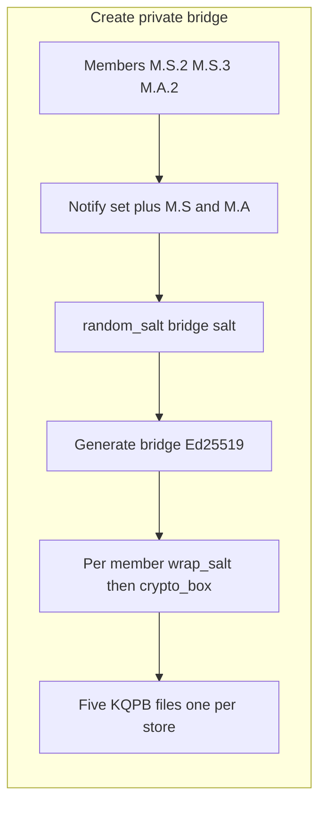

# Private multi-member bridges and signing

## Decisions locked

- **Crypto (1B):** Each private bridge owns a shared Ed25519 keypair. Members sign with the bridge private key and co-attribute with their personal signing public key. Verifiers check the bridge signature, the personal co-signature, and that both parties are current **members** (supervisors can track roster, not co-sign).
- **Independent stores:** `M.S.2`, `M.S.3`, and `M.A.2` are three people. `M.S` and `M.A` are department-manager stores. Label depth: three segments = employee, two = manager, one (`M`) = CXO. A bridge of those three employees notifies **five** stores (members + each distinct direct parent). Grandparent `M` is not notified unless a member is a department manager.
- **Notification:** Phase 1 writes per-recipient `.kqpb` **envelopes** (sealed to that person's encryption pub) plus local `bridge_events` and public `.kqbn` eviction notices. Delivery between devices is out-of-band (operator copies files). **Next PR:** an online mailbox of those envelopes.
- **Salts:** Every bridge generation, member wrap, and signed artifact carries its own random salt from `crypto::random_salt()` (16 bytes).

## Current gaps

- Bridges in [`src/key_tree.rs`](src/key_tree.rs) / [`src/db/schema.sql`](src/db/schema.sql) are **pairwise** (`key_node_links`) with **no key material**.
- [`delete_node_bindings`](src/key_tree.rs) deletes every pair involving an evicted node (no shrink-to-N≥2 semantics).
- [`src/signing.rs`](src/signing.rs) is verify-only; README roadmap still lists `sign` and custody.
- Salts already exist for password/PIN paths (`kdf_salt`, `pin_salt` via [`src/crypto.rs`](src/crypto.rs)); private bridges and signatures do not use them yet.

## Architecture



## Salt design

Reuse [`crypto::random_salt`](src/crypto.rs) (`SALT_LEN = 16`) everywhere below. Do not invent a second salt size.

### 1. Bridge generation salt (public, stored)

Column: `private_bridges.salt` `BLOB NOT NULL`.

- Drawn once at create; **redrawn on every rotate**.
- Public. Copied into `bridge_events.detail` and into every signed artifact so verifiers know which generation they are checking.
- Bound into the signature preimage so a signature from generation N cannot be replayed against generation N+1 even if other fields were confused.

### 2. Per-member wrap salt (public metadata, binding)

Columns on `private_bridge_sealed_keys`: `wrap_salt BLOB NOT NULL`.

- Unique per `(bridge_id, node_id, generation)`.
- Sealed plaintext is `wrap_salt || bridge_ed25519_sk` (32-byte salt prefix + 32-byte key), then `crypto_box` sealed to that member's encryption public key (same primitive as `seal_share`).
- On unseal, require the prefix to match the row's `wrap_salt`. A sealed blob copied onto another member's row fails.
- New wrap salts on rotate; old sealed rows are deleted.

`crypto_box` already supplies an ephemeral nonce inside the ciphertext. Do not add a password-style Argon2id wrap here: members have X25519 keys, not passwords. Argon2id salts stay on vault/PIN/password-file paths.

### 3. Per-signature salt (public, in the artifact)

- 16 random bytes generated at `sign` time, stored in the signature artifact (not in SQLite).
- Bound into **both** Ed25519 preimages (bridge and personal).
- Makes two signatures of the same file distinct as transcripts and binds the artifact to one signing event.

### Signature preimage (domain-separated)

Both keys sign the same preimage:

```
SHA-256(
  "KQBRIDGE-SIGN-v1" ||
  bridge_salt ||
  signature_salt ||
  be64(bridge_id) ||
  signer_node_label ||
  signer_ed25519_pub ||
  message
)
```

Verify recomputes this hash, checks both signatures, then checks live membership of `--node` (signer) and `--as-node` (verifier).

## Phase 1 implementation

### 1. Schema: N-ary private sign bridges

Add tables in [`src/db/schema.sql`](src/db/schema.sql). Keep existing pairwise `key_node_bridges` / `key_node_links` for cross-branch pairing policy; private sign bridges are a separate layer.

- `private_bridges` — `id`, `key_id`, optional `label`, `public_key` (32-byte Ed25519), `salt` (16 bytes), `created_at`, `destroyed_at`
- `private_bridge_members` — `(bridge_id, node_id)` PK; FK to `key_nodes`
- `private_bridge_sealed_keys` — `(bridge_id, node_id, wrap_salt, wrapped_secret)` — plaintext `wrap_salt || sk` sealed to that member's encryption hardware key
- `bridge_events` — append-only: `id`, `key_id`, `bridge_id`, `event_type` (`created` | `member_removed` | `rotated` | `destroyed`), `detail` (JSON: member labels, reason node, `salt` hex of the generation that event refers to), `created_at`

New tables only (`CREATE TABLE IF NOT EXISTS`). No `ALTER` migration.

### 2. Library API for private bridges

New module [`src/private_bridge.rs`](src/private_bridge.rs) (exported from [`src/lib.rs`](src/lib.rs)):

- `create(conn, key_id, member_labels, label?)` — require ≥2 distinct **active** leaf nodes; `random_salt()` for the bridge; generate Ed25519 keypair; per member `random_salt()` then seal; insert membership + event `created`. Create seals using registered **public** encryption keys only (like `seal_share` today).
- `list(conn, key_id)` / `get(conn, bridge_id)` — members, bridge fingerprint/pub, salt, alive vs destroyed.
- `unseal_secret(conn, bridge_id, node_id, encryption_sk)` — crypto_box unseal and check wrap_salt prefix.
- `remove_member(conn, bridge_id, node_id)` — used by eviction path:
  - Delete membership + sealed key for that node.
  - If remaining members < 2: mark bridge destroyed, wipe sealed keys, emit `destroyed`.
  - Else: **rotate** — new Ed25519 keypair, new bridge salt, new wrap salts, reseal to remaining members, update `public_key`/`salt`, emit `member_removed` + `rotated` (departed holders cannot keep forging under the live bridge identity).
- `events(conn, key_id, since_id?)` — for CLI.

Wire into eviction: extend [`evict_and_refresh`](src/key_tree.rs) / [`delete_node_bindings`](src/key_tree.rs) so any private-bridge membership for the evicted node is processed as above. Parent-only authority stays as today: only the parent's revoke/evict path removes a child; cross-dept peers learn via `bridge_events`, not by mutating foreign subtrees.

Also hook [`drop_bindings_for_hardware`](src/key_tree.rs) / revoke without evict: when binds are dropped for a leaf, apply the same member-removal rules to private bridges that include that leaf.

### 3. Signing: bridge + personal subkey

Extend [`src/signing.rs`](src/signing.rs):

- `sign(private_key, message) -> [u8; 64]` — Ed25519 (key material from caller; no DB custody).
- Keep `verify_signature`.
- `sign_with_bridge` / `verify_bridge_signature`:
  - Draw `signature_salt`; build the domain-separated preimage above; sign with (1) bridge sk and (2) personal signing sk.
  - Verify both signatures over that preimage; require signer node and verifier node (`--as-node`) to be **current** members (Phase 1).
  - Artifact fields: `bridge_id`, `bridge_salt`, `signature_salt`, `signer_label`, `signer_pub`, `bridge_sig`, `personal_sig` (hex or a small versioned encoding).

**Leaf vs signing key:** do not put signing keys on quorum leaves (SQL triggers forbid that). At sign/verify time, pass `--signing-key-file` / `--public-key-file` and `--node M.A.2`; membership is by **node label** in the bridge.

**Custody:** private keys still come from files / stdin (same as reconstruct share files). README roadmap “persisted custody” stays deferred.

### 4. CLI ([`src/bin/keyquorum/main.rs`](src/bin/keyquorum/main.rs))

- `bridge private create <key-id> --member M.S.2 --member M.S.3 --member M.A.2 [--label …]`
- `bridge private list <key-id>` / `bridge private show <bridge-id>`
- `bridge private events <key-id> [--since N]`
- Keep existing pairwise `bridge allow|deny|add|remove|list` as-is.
- On `revoke … --evict` (and member-drop paths): print private-bridge event summary (bridge ids, remaining members, destroyed vs rotated, new salt/fingerprint).
- `sign --bridge-id N --node M.A.2 --private-key-file … --share-file … --message-file … --signature-out …`  
  Unseal bridge sk from DB with the member encryption private key (`--share-file` / `.key`); do not require a long-lived bridge-key file.
- `verify` gains `--bridge-id` / `--as-node` / dual-signature artifact input.

### 5. Tests and docs

- Create 3-member bridge; evict one → 2 remain + rotated pub **and new salt**; evict until <2 → destroyed; events emitted.
- Wrap-salt mismatch rejects a copied sealed blob.
- Sign/verify happy path; reject non-member signer/verifier; old bridge sk **and old bridge salt** fail after rotate.
- Same message signed twice yields different artifacts (different `signature_salt`) that both verify.
- Update [`README.md`](README.md) cookbook; Roadmap: `sign` done for file-backed keys; Phase 2 bundles deferred.

## Envelopes

A `.kqpb` file is a **digital envelope**, not a shared database row:

```
KQPB | version | kind | recipient_x25519_pub (32) | len | crypto_box(letter)
```

- **Outside** (routing): who it is for. USB, email, or the next PR’s mailbox can read this and drop the file in that person’s inbox. Same pattern as [`src/export.rs`](src/export.rs) `KQXB` bundles.
- **Inside** (letter): member invite/rotate includes `wrap_salt || bridge_ed25519_sk`; supervisor envelopes include roster + salts only; rotate/destroy letters also carry an auth signature under the previous bridge key.
- **One envelope per store.** `M.S.2`, `M.S.3`, `M.A.2`, `M.S`, and `M.A` each get their own. Copying `M.A.2.kqpb` onto `M.S`’s machine does not let `M.S` open it.
- **`.kqbn` is not an envelope.** Eviction notices are public routing slips so a manager can tell remaining members to rotate. The actual new secret still travels in sealed `.kqpb` envelopes from a remaining member after `remove-member`.

The mailbox server should treat envelopes as opaque: index by recipient fingerprint, never unseal, never rewrite.

## Next PR: online mailbox server

Not this change. A small relay that is an **inbox of envelopes**:

- `POST /inbox` upload a `.kqpb` (route by the envelope’s `recipient_pub`)
- `GET /inbox` pull envelopes for the authenticated encryption fingerprint
- CLI `relay push` / `relay pull --import` (import still happens on the device with `--share-file`)
- No org SQLite, no private keys, no decrypt-and-rewrite on the server
- Rotate/destroy authenticity stays **inside** the letter (previous bridge key)

A browser UI can wait until push/pull works.

## Security notes

- Always **rotate** the shared bridge key **and** the bridge salt on membership loss.
- Wipe sealed rows on destroy/rotate; never leave an old wrap_salt/sk pair readable.
- Never commit bridge secrets, `.key` files, or event payloads containing key material.
- Salts are not secret; treating them as public context is the same stance as vault `kdf_salt` / PIN `pin_salt`.
